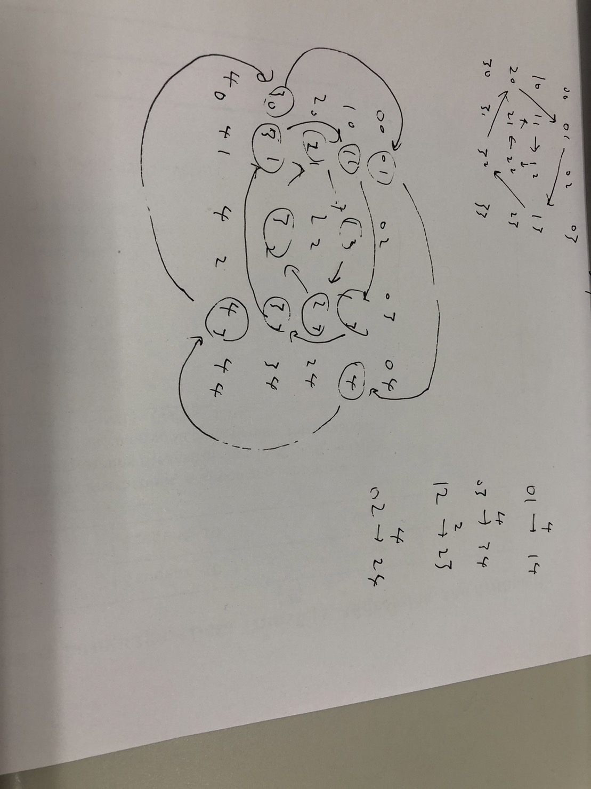

# Leet Code Practice
# 1 two sum
hash table
# 3
counter
# 48 Rotate Image

Start from the outer layer, rotate each layer, until you reach the core.  

# 49 Group Anagrams
hash map
# 54 spiral matrix
iteration, address offsets